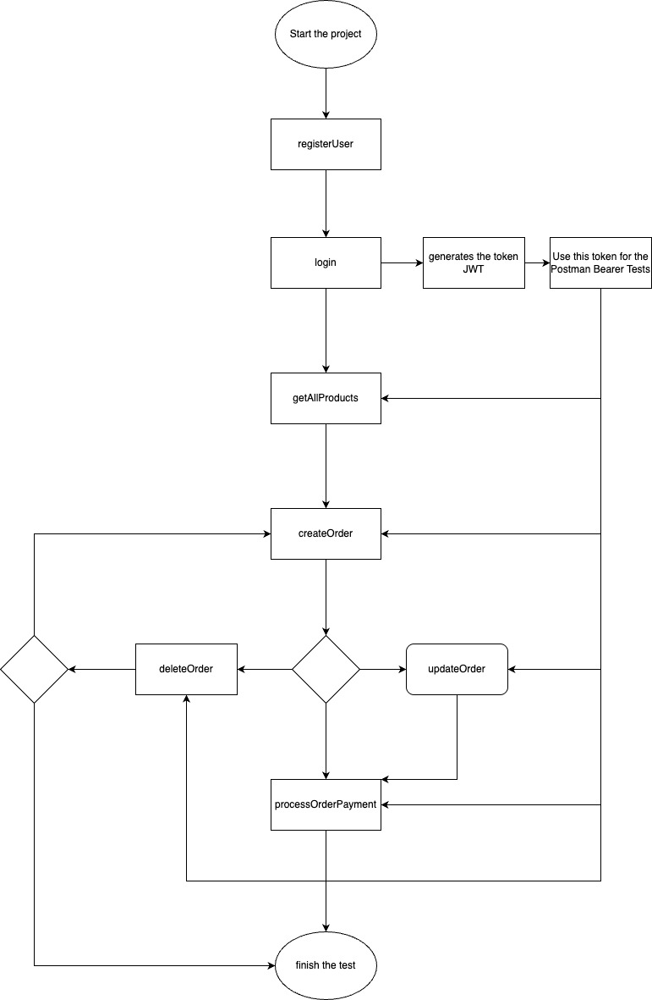

# 🛒 Technical Test - Cuscatlan - adga

This project is a microservices-based solution using Java and Spring Boot, simulating a shopping cart system with external product API integration.

---

## 🧩 General Architecture
The system includes the following modules:

- ✅ Product Microservice (proxy to https://fakestoreapi.com).
- ✅ Order Management (Create, Update, findById,  Delete).
- ✅ Payment Simulation Endpoint.
- ✅ Entities and DTOs: `Client`, `Order`, `OrderDetail`.
- ✅ Delete logic for all entities using `active = false`.
- ✅ Enum fields for `Status`, `OrderStatus`, `PaymentStatus`, `Gender`.
- ✅ `createdAt` and `updatedAt` timestamps for all entities.
- ✅ Security, Authentication and Authorization using JWT.

---

## 📌  Process Diagram


---

## 📁 Project Structure

```
src/main/java/com/technical_test_Cuscatlan_adga/technical_test_adga
|
|-- models
|   |-- Product.java
|   |-- ProductRating.java
|   |-- Client.java (@Entity)
|   |-- Order.java (@Entity)
|   |-- OrderDetail.java (@Entity)
|   |-- enums: OrderStatus.java, PaymentStatus.java, Gender.java, Status.java, RoleType.java
|
|-- dtos
|   |-- ClientDTO.java
|   |-- OrderDTO.java
|   |-- OrderDetailDTO.java
|   |-- auth: AuthRequest.java, AuthResponse.java, RegisterRequest.java
|
|-- wrappers
|   |-- ProductWrapperResponse.java
|   |-- ProductsListWrapperResponse.java
|   |-- PaymentWrapperResponse.java
|   |-- OrderWrapperResponse.java
|   |-- OrderListWrapperResponse.java
|
|-- advisors
|   |-- ResponseAdvisor.java
|
|-- config
|   |-- WebClientConfig.java
|   |-- SecurityConfig.java
|   |-- SecurityBeansConfig.java
|
|-- services
|   |-- ProductService.java
|   |-- OrderService.java
|   |-- PaymentService.java
|   |-- JwtService.java
|   |-- AuthenticationService.java
|   |-- CustomUserDetailsService.java
|
|-- repositories
|   |-- ClientRepository.java
|   |-- OrderRepository.java
|   |-- OrderDetailRepository.java
|   |-- UserRepository.java
|
|-- controllers
|   |-- ProductController.java
|   |-- OrderController.java
|   |-- PaymentController.java
|   |-- AuthController.java
|
|-- security
|   |-- User.java
|   |-- JwtAuthenticationFilter.java
|   |-- UserPrincipal.java
|   |-- UserDetailsServiceImpl.java
```

---

## 🚀 API Endpoints

### 🛒 Products Controller - `/api/products/v1`

| Method | Endpoint                             | Description                    |
|--------|--------------------------------------|--------------------------------|
| GET    | `/get-all-products`                  | Returns all products           |
| GET    | `/find-product-by-id/{id}`           | Returns product by ID          |

### 📦 Orders Controller - `/api/orders/v1`

| Method | Endpoint                                      | Description                     |
|--------|-----------------------------------------------|---------------------------------|
| POST   | `/create-order`                               | Create a new order              |
| PUT    | `/update-order-by-id/{id}`                    | Update an existing order        |
| DELETE | `/delete-order-by-id/{id}`                    | Soft-delete an order            |
| GET    | `/get-all-orders`                             | List all active orders          |
| GET    | `/find-order-by-id/{id}`                      | Get specific order by ID        |

### 💳 Payments Controller - `/api/payments/v1`

| Method | Endpoint                                      | Description                     |
|--------|-----------------------------------------------|---------------------------------|
| POST   | `/process-order-payment/{orderId}`            | Simulate a payment for an order |

### 🔐 Authentication Controller - `/api/auth/v1`

| Method | Endpoint         | Description             |
|--------|------------------|-------------------------|
| POST   | `/register`      | Register new user       |
| POST   | `/login`         | Authenticate and get JWT|

---

---
 ### 🔮 Response Format
-All APIs return a standard structure with:
ResponseAdvisor

    {
      "<result>": {...},
      "responseAdvisor": {
      "errorCode": 200,
      "statusError": "SUCCESS",
      "errorMessages": ["message"]
      }
    }


---

## 🧪 Postman Example Collection

### ✅ Authentication (Login / Register)
1. **Register:**
```
POST http://localhost:8080/api/auth/v1/register
Body (JSON):
{
  "username": "admin",
  "password": "admin123",
  "role": "ADMIN"
}
```
2. **Login:**
```
POST http://localhost:8080/api/auth/v1/login
Body (JSON):
{
  "username": "admin",
  "password": "admin123"
}
Response:
{
  "token": "eyJhb..."
}
```
> 🔐 Use this token as Bearer Token in Authorization header for protected routes

### 🛒 Products
```
GET http://localhost:8080/api/products/v1/get-all-products
GET http://localhost:8080/api/products/v1/find-product-by-id/1
```

### 📦 Orders
```
GET http://localhost:8080/api/orders/v1/get-all-orders
GET http://localhost:8080/api/orders/v1/find-order-by-id/{orderId}
DELETE http://localhost:8080/api/orders/v1/delete-order-by-id/{orderId}
```

**Create Order**
```
POST http://localhost:8080/api/orders/v1/create-order
Body:
{
  "client": {
    "id": "d7842f91-81da-4a9a-a18d-6a5c2c1a9770",
    "name": "Angel David",
    "lastName": "González Ardón",
    "identificationNumber": "0703199905137",
    "birthday": "1999-08-26",
    "phoneNumber": 33570625,
    "email": "angelgonzalez.nl90@gmail.com",
    "active": true
  },
  "orderDetails": [
    {
      "productId": 1,
      "amount": 2,
      "unitPrice": 50.0,
      "active": true
    },
    {
      "productId": 3,
      "amount": 1,
      "unitPrice": 80.0,
      "active": true
    }
  ]
}
```

**Update Order**
```
PUT http://localhost:8080/api/orders/v1/update-order-by-id/{orderId}
Body:
{
  "client": {
    "id": "d7842f91-81da-4a9a-a18d-6a5c2c1a9770",
    "name": "David",
    "lastName": "Ardón",
    "identificationNumber": "0801199905137",
    "birthday": "1999-08-26",
    "phoneNumber": 98313233,
    "email": "angelgonzalez.nl90@gmail.com",
    "active": true
  },
  "orderDetails": [
    {
      "productId": 1,
      "amount": 5,
      "unitPrice": 50.0,
      "active": true
    }
  ],
  "active": true,
  "status": "CREATED"
}
```

### 💳 Payments Order (Simulated)
```
POST http://localhost:8080/api/payments/v1/process-order-payment/{orderId}
```

---

## ✅ Status

All required and optional sections of the technical test are **fully implemented**, tested and documented.

You're ready to impress 😎🚀
